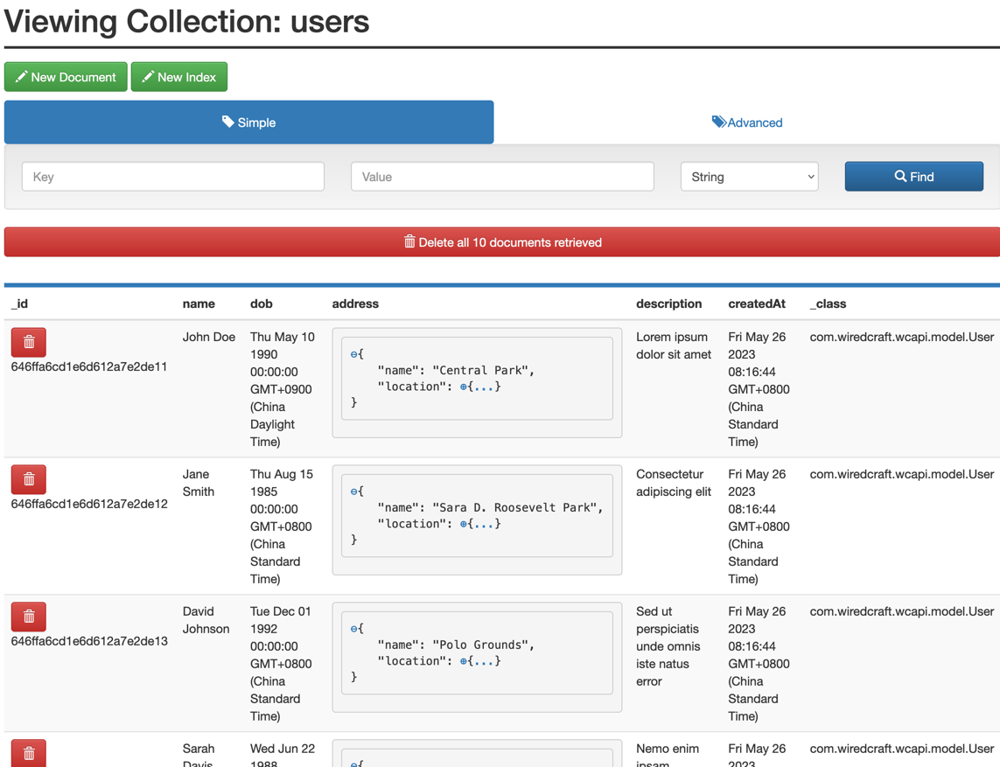
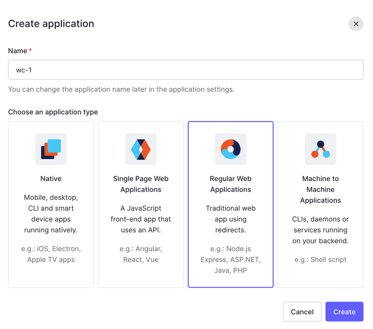
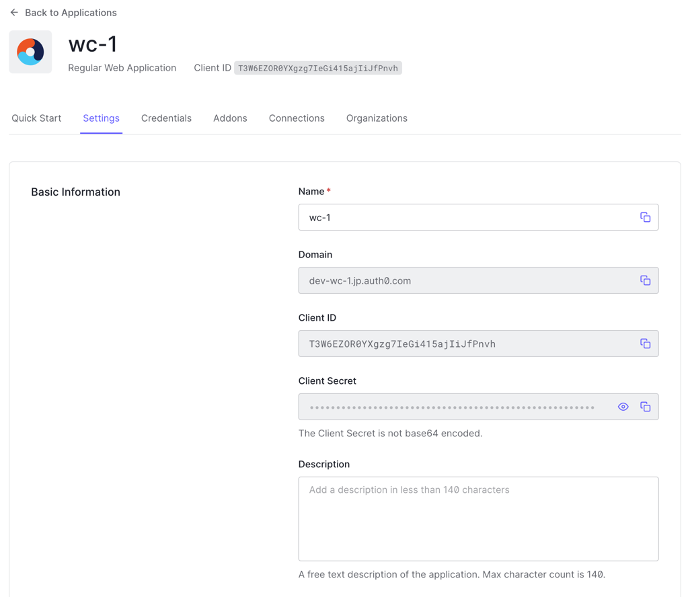
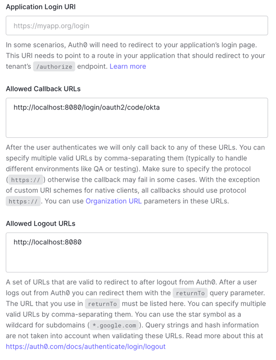

# Wiredcraft Back-end Developer Test

[](https://codecov.io/gh/bigfei/test-backend-java)

## Introduction
It is a simple LBS service that offers nearby searches, following/followers lists, 
and profile updates, according to the [Requirement](docs/REQ.md).


## Quick Start and Demo
### Prerequisite
1. Run docker-compose to setup a mongodb server:
```shell
docker-compose up -d --build
```
After the mongodb get started, login into `http://localhost:8081` to verify the db collections status:

then change the mongodb settings in file `src/main/resources/application.yml` accordingly.
2. Register an auth0.com account and app for oauth2 integration.
   1. Visit auth0.com and create an app as follows: 
   2. Copy the domain / ClientID / ClientSecret from the settings page: 
   3. Add the callback Urls and logout Urls on settings page: 
   3. Modify the `src/main/resources/application.yml` with the auth0 settings from the last step.
3. Run `./mvnw spring-boot:run` to start the app.

### Demo
Or if you want just to feel the app, visit `https://wc-api.bigfei.me`.

## Under the hood
### Tech Stack
- **MongoDB** Use mongodb as the DB for faster searches and [geospatial](https://www.mongodb.com/docs/manual/reference/operator/aggregation/geoNear/) functions.
- **Springboot Framework** as the de factro for Java world to build any restful api things.
- Use jWT and **Auth0** as the oauth2 provider for prototype building and MVP.
- **Github Actions** are used for CI solution.
- Cloudflare Tunnel for free https access and CDN services.
- Docker for deployment and testing.
- **Thymeleaf** adds support for Server-Side View Rendering.
- **Sentry** for logging APM.

## System design and User Story

### User Restful API

| Method | Endpoints      | Usage                                      |
|--------|----------------|--------------------------------------------|
| POST   | /users         | create a User                              |
| GET    | /users         | list Users                                 |
| GET    | /users/{id}    | list single User                           |
| PUT    | /users/{id}    | update a User                              |
| DELETE | /users/{id}    | delete a User                              |
| GET    | /users/profile | show a profile page for current logon user |
| GET    | /users/me      | show user details for current user         |

### OAuth2
Use auth0.com as the backend oauth provider and okta-spring-boot-starter for springboot supports.
See the config details from the [Prerequisite](#prerequisite)

### Followers/Friend List
Add a mongodb collection as the follower/followee relationship. 
Use [DBRef](https://www.mongodb.com/docs/manual/reference/database-references/) 
for mapping the reference relationship.

| follows   |   |
|-----------|---|
| followee  |   |
| follower  |   |
| createdAt |   |

APIs:

| Method | Endpoints                      | Usage                                                       |
|--------|--------------------------------|-------------------------------------------------------------|
| GET    | /users/{id}/followers          | a list of users who are followers of the specified user ID. |
| GET    | /users/{id}/following          | a list of users the specified user ID is following          |
| POST   | /users/{id}/following/{target} | let a user to follow another user                           |
| DELETE | /users/{id}/following/{target} | let a user to unfollow another user                         |

### Near me
Use mongodb geospatial search to do geo search around a specific geo points (aka geocaches).
1. Friends: they are following each other.
2. Nearme: Near the location point using geo search (`$geoNear`).

APIs: 

| Method | Endpoints                             | Usage                                                             |
|--------|---------------------------------------|-------------------------------------------------------------------|
| GET    | /users/{id}/nearFriends?distanceKm=10 | a list of friends within a distance of 10 kilometers from userId. |


## Todos and Caveats

### Backlog
- [ ] Sentry APM integration.
- [x] Github Actions CI.
- [ ] Swagger API docs.
- [ ] Put secrets into .env file for safety.

### Caveats
1. Use Mongodb match/in pipelines for checking a user friends list rather than naive recursive searching.

